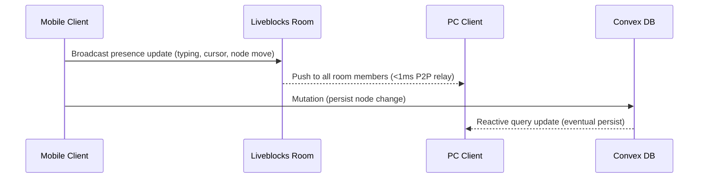
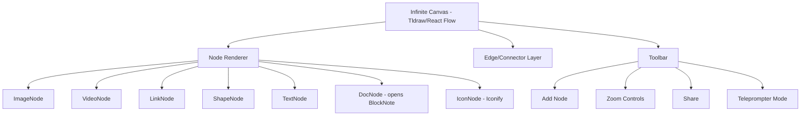

# MoodBoard Max — Product & Architecture Spec

# MoodBoard Max

A SaaS infinite canvas + built-in document editor, purpose-built for YouTubers. Think Miro meets Google Docs — paste images, videos, and links onto an infinite canvas, connect them with flexible pointers, write scripts with a teleprompter, and collaborate in real-time with sub-millisecond sync across mobile and desktop.

## Core Features

| Feature | Description |
| --- | --- |
| Infinite Canvas | Pan, zoom, unlimited space for nodes |
| Node Types | Image, Video, Link, Shape, Text, Doc |
| Connectors | Flexible arrows/pointers between any nodes |
| Icons | Unlimited icons via Iconify free API |
| Built-in Doc | Rich text editor embedded in canvas or full-screen |
| Teleprompter | Full-screen reading mode with speed/font controls |
| Real-time Sync | Mobile → PC in ~1ms via Liveblocks presence + Convex mutations |
| Media Storage | Paste = use original URL; Upload = Cloudflare R2 / Cloudinary |
| Sharing | Public share link, view-only or edit mode |
| Mobile Layout | Touch-friendly, responsive, gesture-based canvas |

## Tech Stack

### Frontend

| Layer | Choice | Reason |
| --- | --- | --- |
| Framework | **Next.js 14 (App Router)** | SSR, file-based routing, edge-ready |
| Canvas Engine | **Tldraw v2** or **React Flow** | Battle-tested infinite canvas, open source |
| Rich Text | **BlockNote** or **TipTap** | Notion-like doc editor, extensible |
| Icons | **Iconify React** (`@iconify/react`) | 200k+ free icons, no API key needed |
| Styling | **Tailwind CSS** | Utility-first, mobile-responsive |
| State | **Zustand** | Lightweight client state |

### Backend / Real-time

| Layer | Choice | Reason |
| --- | --- | --- |
| Database + API | **Convex** (`fiery-chicken-279`) | Reactive queries, serverless functions, free tier |
| Real-time Presence | **Liveblocks** | Sub-ms cursor/presence sync, rooms per board |
| Auth | **Clerk** | Drop-in auth, social login, JWT |
| File Storage | **Cloudflare R2** (uploads) + direct URL (pastes) | Cheap egress, S3-compatible |

### Real-time Latency Strategy

The ~0.001ms target is achieved by layering two systems:



- **Liveblocks** handles ephemeral real-time (cursors, live typing preview) — this is the sub-ms path
- **Convex** handles durable persistence (node positions, content, docs) — reactive, no polling
- Result: PC sees typing from mobile almost instantly via Liveblocks, with Convex as the source of truth

## Data Model (Convex Schema)

```
boards
  _id, ownerId, title, shareToken, isPublic, createdAt

nodes
  _id, boardId, type (image|video|link|shape|text|doc|icon)
  x, y, width, height
  content (text / URL / iconName / docId)
  style (color, fontSize, fontFamily, opacity)
  createdAt, updatedAt

edges (connectors)
  _id, boardId, fromNodeId, toNodeId
  style (arrow type, color, label)

docs
  _id, boardId, nodeId (optional — standalone or embedded)
  title, content (BlockNote JSON)
  updatedAt

boards_members
  boardId, userId, role (owner|editor|viewer)
```

## Media Handling Strategy (Cheap & Scalable)

| Action | Behavior |
| --- | --- |
| Paste image/video URL | Store URL only — render via `` or `<video>` tag, zero storage cost |
| Paste YouTube link | Auto-embed via `youtube-nocookie.com` iframe |
| Upload file | Upload to **Cloudflare R2** via presigned URL, store R2 public URL in Convex |
| Large video upload | Use **Cloudflare Stream** (pay-per-minute, cheap) or store R2 link |

This keeps storage costs near zero for the majority of users who paste links.

## Canvas Architecture



## Teleprompter Mode

- Full-screen overlay triggered from toolbar
- Reads content from selected Doc node or all text nodes in order
- Controls: scroll speed (1–10), font size, font family, pause/play, mirror text toggle
- Mobile: swipe up to scroll, tap to pause

## Sharing

- Each board gets a unique `shareToken` (nanoid)
- Share URL: `https://app.com/board/[shareToken]`
- View-only: canvas is read-only, no auth required
- Edit invite: requires Clerk auth + board membership

## Mobile Responsiveness

- Canvas: pinch-to-zoom, two-finger pan, tap to select node
- Toolbar: bottom sheet on mobile, left sidebar on desktop
- Doc editor: full-screen modal on mobile
- Teleprompter: optimized for portrait mobile reading

## Environment Variables (Already Configured)

```
CONVEX_DEPLOYMENT=fiery-chicken-279
NEXT_PUBLIC_CONVEX_URL=https://fiery-chicken-279.convex.cloud
NEXT_PUBLIC_CLERK_PUBLISHABLE_KEY=pk_test_...
CLERK_SECRET_KEY=sk_test_...
NEXT_PUBLIC_LIVEBLOCKS_PUBLIC_KEY=pk_prod_...
NEXT_PUBLIC_LIVEBLOCKS_SECRET_KEY=sk_prod_...
```

Additional env vars needed:

```
CLOUDFLARE_R2_ACCOUNT_ID=
CLOUDFLARE_R2_ACCESS_KEY_ID=
CLOUDFLARE_R2_SECRET_ACCESS_KEY=
CLOUDFLARE_R2_BUCKET_NAME=
CLOUDFLARE_R2_PUBLIC_URL=
```

## Wireframes

### Desktop Canvas View

```wireframe

<html>
<head>
<style>
* { box-sizing: border-box; margin: 0; padding: 0; font-family: sans-serif; }
body { display: flex; height: 100vh; background: #f0f0f0; overflow: hidden; }
.sidebar { width: 56px; background: #1a1a2e; display: flex; flex-direction: column; align-items: center; padding: 12px 0; gap: 16px; }
.sidebar .logo { color: #fff; font-weight: bold; font-size: 18px; }
.sidebar .tool { width: 36px; height: 36px; background: #2a2a4e; border-radius: 8px; display: flex; align-items: center; justify-content: center; color: #aaa; font-size: 18px; cursor: pointer; }
.sidebar .tool.active { background: #6c63ff; color: #fff; }
.main { flex: 1; display: flex; flex-direction: column; }
.topbar { height: 48px; background: #fff; border-bottom: 1px solid #e0e0e0; display: flex; align-items: center; padding: 0 16px; gap: 12px; }
.topbar .board-title { font-weight: 600; font-size: 15px; flex: 1; }
.topbar .btn { padding: 6px 14px; border-radius: 6px; border: 1px solid #ddd; background: #fff; font-size: 13px; cursor: pointer; }
.topbar .btn.primary { background: #6c63ff; color: #fff; border-color: #6c63ff; }
.canvas-area { flex: 1; position: relative; background: #f8f8ff; background-image: radial-gradient(circle, #ccc 1px, transparent 1px); background-size: 24px 24px; overflow: hidden; }
.node { position: absolute; border: 2px solid #6c63ff; border-radius: 8px; background: #fff; padding: 8px; font-size: 12px; cursor: move; box-shadow: 0 2px 8px rgba(0,0,0,0.1); }
.node.image { width: 160px; height: 110px; top: 80px; left: 120px; display: flex; align-items: center; justify-content: center; background: #e8e8ff; color: #6c63ff; font-size: 11px; }
.node.text { width: 140px; top: 220px; left: 340px; }
.node.doc { width: 180px; top: 80px; left: 340px; background: #fff8e1; border-color: #ffc107; }
.node.video { width: 200px; height: 120px; top: 220px; left: 120px; background: #1a1a2e; color: #fff; display: flex; align-items: center; justify-content: center; border-color: #333; }
.connector { position: absolute; top: 155px; left: 200px; width: 140px; height: 2px; background: #6c63ff; transform: rotate(-10deg); }
.connector::after { content: '▶'; position: absolute; right: -8px; top: -8px; color: #6c63ff; font-size: 14px; }
.zoom-controls { position: absolute; bottom: 20px; right: 20px; display: flex; gap: 6px; }
.zoom-btn { width: 32px; height: 32px; background: #fff; border: 1px solid #ddd; border-radius: 6px; display: flex; align-items: center; justify-content: center; font-size: 16px; cursor: pointer; box-shadow: 0 1px 4px rgba(0,0,0,0.1); }
.presence { position: absolute; top: 12px; right: 12px; display: flex; gap: -4px; }
.avatar { width: 28px; height: 28px; border-radius: 50%; background: #6c63ff; border: 2px solid #fff; display: flex; align-items: center; justify-content: center; color: #fff; font-size: 11px; font-weight: bold; }
.avatar:nth-child(2) { background: #ff6584; margin-left: -8px; }
</style>
</head>
<body>
<div class="sidebar">
  <div class="logo">M</div>
  <div class="tool active" title="Select">↖</div>
  <div class="tool" title="Image">🖼</div>
  <div class="tool" title="Video">▶</div>
  <div class="tool" title="Link">🔗</div>
  <div class="tool" title="Text">T</div>
  <div class="tool" title="Shape">◻</div>
  <div class="tool" title="Icon">★</div>
  <div class="tool" title="Doc">📄</div>
  <div class="tool" title="Connect">⟶</div>
  <div class="tool" title="Teleprompter">📺</div>
</div>
<div class="main">
  <div class="topbar">
    <div class="board-title">My YouTube Video Plan 🎬</div>
    <div class="btn">Share</div>
    <div class="btn primary">+ Invite</div>
  </div>
  <div class="canvas-area">
    <div class="presence">
      <div class="avatar">Y</div>
      <div class="avatar">A</div>
    </div>
    <div class="node image">📷 Thumbnail Idea</div>
    <div class="node video">▶ Intro Clip</div>
    <div class="node text">Script outline:<br>1. Hook<br>2. Main content<br>3. CTA</div>
    <div class="node doc">📄 Full Script Doc<br><small style="color:#888">Click to open editor</small></div>
    <div class="connector"></div>
    <div class="zoom-controls">
      <div class="zoom-btn">−</div>
      <div class="zoom-btn" style="width:48px;font-size:11px;">100%</div>
      <div class="zoom-btn">+</div>
    </div>
  </div>
</div>
</body>
</html>
```

### Mobile Canvas View

```wireframe

<html>
<head>
<style>
* { box-sizing: border-box; margin: 0; padding: 0; font-family: sans-serif; }
body { width: 375px; height: 812px; background: #f8f8ff; position: relative; overflow: hidden; }
.topbar { height: 52px; background: #fff; border-bottom: 1px solid #e0e0e0; display: flex; align-items: center; padding: 0 14px; gap: 10px; }
.topbar .title { font-weight: 600; font-size: 14px; flex: 1; }
.topbar .share-btn { padding: 5px 12px; background: #6c63ff; color: #fff; border-radius: 6px; font-size: 12px; }
.canvas { flex: 1; background: #f8f8ff; background-image: radial-gradient(circle, #ccc 1px, transparent 1px); background-size: 20px 20px; height: calc(100% - 52px - 72px); position: relative; }
.node { position: absolute; border: 2px solid #6c63ff; border-radius: 8px; background: #fff; padding: 8px; font-size: 11px; box-shadow: 0 2px 6px rgba(0,0,0,0.1); }
.node.img { width: 130px; height: 90px; top: 30px; left: 20px; background: #e8e8ff; display: flex; align-items: center; justify-content: center; color: #6c63ff; }
.node.txt { width: 120px; top: 30px; left: 200px; }
.node.vid { width: 150px; height: 90px; top: 160px; left: 100px; background: #1a1a2e; color: #fff; display: flex; align-items: center; justify-content: center; border-color: #333; }
.bottom-toolbar { position: absolute; bottom: 0; left: 0; right: 0; height: 72px; background: #fff; border-top: 1px solid #e0e0e0; display: flex; align-items: center; justify-content: space-around; padding: 0 8px; }
.tool-btn { display: flex; flex-direction: column; align-items: center; gap: 3px; font-size: 10px; color: #555; }
.tool-btn .icon { width: 36px; height: 36px; background: #f0f0ff; border-radius: 10px; display: flex; align-items: center; justify-content: center; font-size: 18px; }
.tool-btn.active .icon { background: #6c63ff; color: #fff; }
.fab { position: absolute; bottom: 84px; right: 16px; width: 48px; height: 48px; background: #6c63ff; border-radius: 50%; display: flex; align-items: center; justify-content: center; color: #fff; font-size: 24px; box-shadow: 0 4px 12px rgba(108,99,255,0.4); }
</style>
</head>
<body>
<div class="topbar">
  <div class="title">My Board 🎬</div>
  <div class="share-btn">Share</div>
</div>
<div class="canvas">
  <div class="node img">🖼 Thumbnail</div>
  <div class="node txt">Script:<br>1. Hook<br>2. Content<br>3. CTA</div>
  <div class="node vid">▶ Intro</div>
</div>
<div class="fab">+</div>
<div class="bottom-toolbar">
  <div class="tool-btn active"><div class="icon">↖</div>Select</div>
  <div class="tool-btn"><div class="icon">T</div>Text</div>
  <div class="tool-btn"><div class="icon">📄</div>Doc</div>
  <div class="tool-btn"><div class="icon">⟶</div>Connect</div>
  <div class="tool-btn"><div class="icon">📺</div>Prompt</div>
</div>
</body>
</html>
```

### Teleprompter Mode

```wireframe

<html>
<head>
<style>
* { box-sizing: border-box; margin: 0; padding: 0; font-family: sans-serif; }
body { width: 375px; height: 812px; background: #000; color: #fff; display: flex; flex-direction: column; }
.tp-header { padding: 16px; display: flex; justify-content: space-between; align-items: center; border-bottom: 1px solid #222; }
.tp-header .title { font-size: 14px; color: #aaa; }
.tp-header .close { color: #aaa; font-size: 20px; }
.tp-content { flex: 1; overflow: hidden; display: flex; align-items: center; justify-content: center; padding: 24px; }
.tp-text { font-size: 28px; line-height: 1.6; text-align: center; color: #fff; }
.tp-text .highlight { color: #6c63ff; }
.tp-controls { padding: 16px; border-top: 1px solid #222; display: flex; flex-direction: column; gap: 12px; }
.speed-row { display: flex; align-items: center; gap: 10px; font-size: 13px; color: #aaa; }
.speed-slider { flex: 1; height: 4px; background: #333; border-radius: 2px; position: relative; }
.speed-slider .fill { width: 40%; height: 100%; background: #6c63ff; border-radius: 2px; }
.speed-slider .thumb { position: absolute; left: 40%; top: -6px; width: 16px; height: 16px; background: #6c63ff; border-radius: 50%; margin-left: -8px; }
.btn-row { display: flex; gap: 10px; justify-content: center; }
.tp-btn { padding: 10px 20px; border-radius: 8px; background: #222; color: #fff; font-size: 14px; border: none; }
.tp-btn.primary { background: #6c63ff; }
.font-row { display: flex; gap: 8px; align-items: center; font-size: 13px; color: #aaa; }
.font-btn { padding: 4px 10px; background: #222; border-radius: 4px; font-size: 12px; }
</style>
</head>
<body>
<div class="tp-header">
  <div class="title">📺 Teleprompter</div>
  <div class="close">✕</div>
</div>
<div class="tp-content">
  <div class="tp-text">
    <span class="highlight">Hey everyone, welcome back</span> to the channel! Today we're going to talk about something really exciting that I've been working on for the past few weeks...
  </div>
</div>
<div class="tp-controls">
  <div class="speed-row">
    <span>Speed</span>
    <div class="speed-slider"><div class="fill"></div><div class="thumb"></div></div>
    <span>4x</span>
  </div>
  <div class="font-row">
    <span>Font</span>
    <div class="font-btn">A−</div>
    <div class="font-btn">A+</div>
    <div class="font-btn">Mirror</div>
    <div class="font-btn">Family</div>
  </div>
  <div class="btn-row">
    <div class="tp-btn">⏮ Restart</div>
    <div class="tp-btn primary">⏸ Pause</div>
    <div class="tp-btn">✕ Exit</div>
  </div>
</div>
</body>
</html>
```

## Video Studio — Remotion-Powered Explainer Engine

MoodBoard Max includes a built-in **Video Studio** that turns any board into a cinematic Apple-style explainer video — locally rendered, no editor needed.

| Feature | Description |
| --- | --- |
| Remotion Engine | React-based video rendering, runs 100% in browser/local |
| Camera Follow | Animated camera pans/zooms to each node in sequence |
| Motion Text Effects | Fade-in, slide-up, typewriter, scale-pop (Apple style) |
| Voice Recording | Record narration per scene or full board |
| Face Cam Overlay | Picture-in-picture webcam view while editing |
| Bangla Font Support | Hind Siliguri / Noto Sans Bengali via Google Fonts |
| Scene Timeline | Drag-reorder scenes, set duration per node |
| Export | MP4 via Remotion CLI or browser render |
| Share as Video | Upload rendered MP4 to R2, share public link |

## APIs & Packages Summary

| Package | Purpose |
| --- | --- |
| `convex` | Database, serverless functions, reactive queries |
| `@clerk/nextjs` | Authentication |
| `@liveblocks/react` | Real-time presence, room sync |
| `tldraw` | Infinite canvas engine |
| `@blocknote/react` | Rich text / doc editor |
| `@iconify/react` | 200k+ free icons |
| `@aws-sdk/client-s3` | Cloudflare R2 uploads (S3-compatible) |
| `nanoid` | Share token generation |
| `zustand` | Client state management |
| `tailwindcss` | Styling |
| `next` | Framework |
| `remotion` | React-based video rendering engine |
| `@remotion/player` | In-browser video preview player |
| `@remotion/media-utils` | Audio/video utilities for Remotion |
| `@remotion/google-fonts` | Google Fonts (incl. Bangla) in Remotion |
| `react-webcam` | Face cam / webcam capture in browser |